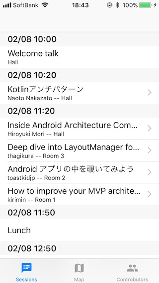
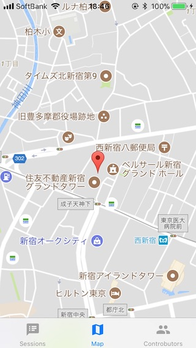
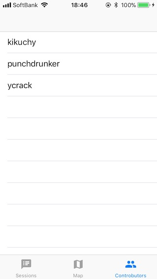

# DroidKaigi 2018 unofficial iOS app

This project is **Kotlin/Native** iOS app of DroidKaigi2018.


# Official Android app project

[Official is here](https://github.com/DroidKaigi/conference-app-2018).


# Features





* Check all of sessions.
* Find the place of DroidKaigi will be held.
* See contributors of this app. (Please encourage us!)

# Contributing
We are always welcome your contribution!

You can find [open isssues here](https://github.com/kikuchy/DroidKaigi2018iOS/issues), `welcome contribute` or `easy` tagged issues are good for first contribute.

Making new issues is welcome too!


## Before senfing PullRequest

Please, don't include your team in `project.pbxproj` when commiting. :pray:


# Development Environment

## requirement

- machine running macOS installed Xcode 9.2
- Apple developer program account
- iOS devices for running binary (iOS Simulator is unavailable for Kotlin/Native)
- CLion (optional)

## Kotlin/Native

To compile Kotlin/Native use following steps:

```
git clone https://github.com/JetBrains/kotlin-native.git
cd kotlin-native
./gradlew dependencies:update
# this may take around a hour
./gradlew dist distPlatformLibs
export PATH=./dist/bin:$PATH
```

You can find Kotlin/Native introduction in [here](https://kotlinlang.org/docs/reference/native-overview.html).

The instance of Kotlin/Native iOS app is [KotlinConf 2017 app](https://github.com/JetBrains/kotlinconf-app). We reference it to write codes.


## How to build iOS app

1. (optional) Open `ios/` directory with CLion.
1. (optional) Write your code. Put your code under `ios/src/main/kotlin/`.
1. Open `ios/DroidKaigi2018.xcodeproj` with Xcode.
1. Connect your iOS device to your mac.
1. Choose your iOS device as running target.
1. In Xcode, select your Team at `DroidKaigi2018` > `General` Tab > (in left pain `TARGET`) `DroidKaigi2018` > `Signing` Section > `Team` pull down menu.
    - If you have no team options,  choose `Add an Acount...` and add your Apple ID.
    - Maybe you can find your Personal Team.
1. Run and you can find `DroidKaigi2018` app in your home screen!
    - If you using Personal Team, in first time, you have to accept your Signing Certificate from `Settings.app` > `General` > `Device Management `.

## How to add new pod

It's little confusing for me (and maybe you).

1. Add new pod into Podfile normally.
1. Archive pod as framework. (Select that scheme in Xcode and `Product` > `Archive`)
1. Copy framework from DerivedData into `Frameworks` directory.
1. Add header files we want to use in Kotlin, linker/compiler options into `src/main/c_interop/libs.def`.
1. Run `compileKonanLibs` gradle task.


## Credit
This project uses some modern libraries and source codes.

* [Kotlin](http://kotlinlang.org/) - JetBrains
* [Kotlin/Native](https://github.com/JetBrains/kotlin-native/) - JetBrains
* [kotlinconf-app](https://github.com/JetBrains/kotlinconf-app) - JetBranis
* [conference-app-2018](https://github.com/DroidKaigi/conference-app-2018) - DroidKaigi

## License

TBD
